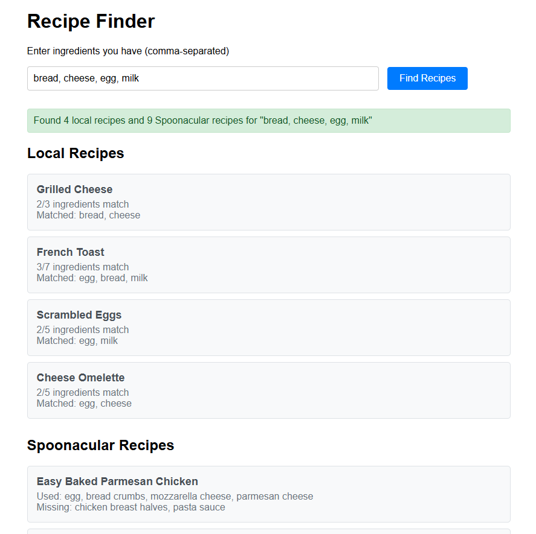

# Recipe Suggestion Microservice

A Flask-based microservice that finds recipes based on available ingredients. Combines a local recipe database with the Spoonacular API to provide curated recipe suggestions.

**Built by:** Final-year Software Engineering student  
**Purpose:** Learning Flask, API integration, and backend development  
**Status:** Complete and functional - ready for future enhancements



## What It Does

- Enter ingredients you have available
- Get ranked recipe suggestions from both local database (40+ recipes) and Spoonacular API
- Smart filtering: adapts based on how many ingredients you provide
- Web interface for easy testing and demonstration

## Features

**Hybrid Recipe Sources:**
- Local database with 40+ curated recipes across multiple cuisines
- External API integration with Spoonacular for thousands more recipes

**Intelligent Matching Algorithm:**
- Percentage-based scoring (not just raw ingredient counts)
- Adaptive filtering: ≤3 ingredients returns top 5 matches, >3 ingredients requires ≥40% match
- Normalized response format for consistent results

**Error Handling:**
- Graceful fallback when external API is unavailable
- Validates user input and provides helpful error messages

**Web Interface:**
- Simple HTML/JavaScript frontend for testing
- Real-time search with results displayed by source

## Tech Stack

- **Backend:** Flask (Python)
- **External API:** Spoonacular Recipe API
- **Algorithm:** Set-based ingredient matching with percentage scoring
- **Frontend:** HTML/CSS/JavaScript (vanilla)
- **Configuration:** python-dotenv for environment management

## Project Structure

```
recipe-microservice/
├── main.py                    # Flask application
├── services/
│   └── spoonacular_service.py # External API integration
├── data/
│   └── recipes.py             # Local recipe database
├── templates/
│   └── index.html             # Web interface
├── config.py                  # Configuration management
├── .env                       # API keys (not committed)
└── requirements.txt
```

## Getting Started

### Prerequisites
- Python
- Spoonacular API key (optional - works without it using local recipes only)

### Setup
```bash
# Install dependencies
pip install -r requirements.txt

# Create .env file (optional for Spoonacular API)
echo "SPOONACULAR_API_KEY=your_key_here" > .env

# Run the server
python main.py
```

### Usage
- **Web Interface:** `http://localhost:5000/interface`
- **API Endpoint:** `http://localhost:5000/find_recipe/egg,cheese,milk`
- **Test API:** `http://localhost:5000/test_api/chicken,rice`

## API Response Format

```json
{
  "query": "egg,cheese,milk",
  "local_recipes": [
    ["Cheese Omelette", {
      "total_matches": 2,
      "total_ingredients": 5,
      "matched_ingredients": ["egg", "cheese"],
      "match_percentage": 40.0
    }]
  ],
  "spoonacular_recipes": [
    {
      "title": "Perfect Omelet",
      "total_matches": 2,
      "total_ingredients": 6,
      "matched_ingredients": ["egg", "cheese"],
      "missed_ingredients": ["butter", "salt"],
      "match_percentage": 33.3
    }
  ],
  "total_local": 3,
  "total_api": 5,
  "status": "local + spoonacular"
}
```

## Algorithm

**Matching Logic:**
1. Calculate match percentage: `(matched_ingredients / total_ingredients) × 100`
2. Apply adaptive filtering:
   - ≤3 user ingredients: Return top 5 matches
   - >3 user ingredients: Only show recipes with ≥40% match
3. Sort by match percentage (primary), then by recipe complexity (secondary)

**Why This Works:**
- Prevents low-relevance results (recipes using only 1 of 8 ingredients)
- Handles small searches gracefully (doesn't over-filter when few ingredients given)
- Consistent logic across both local and external data sources

## Learning Outcomes

This project demonstrated:
- Flask microservice architecture and best practices
- External API integration with error handling
- Algorithm optimization (nested loops → set operations)
- Frontend-backend communication
- Environment-based configuration management
- Code refactoring and DRY principles

## Future Enhancements

**Phase 3 Ideas (when returning to project):**
- Mobile app integration (Flutter/React Native)
- Redis caching for frequent queries
- Recipe substitution suggestions
- User preference learning
- Database migration (SQLite/PostgreSQL)
- Docker containerization
- Comprehensive API documentation

## License

Personal learning project - feel free to reference or adapt for educational purposes.

---


**Project Status:** Core functionality complete. Taking a break before adding mobile integration and advanced features.

